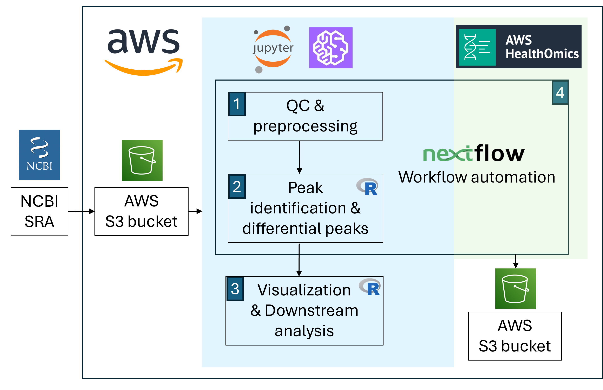
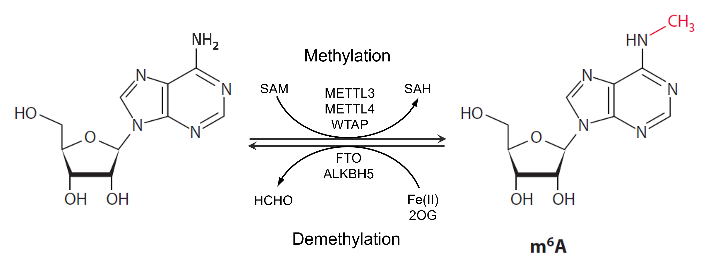
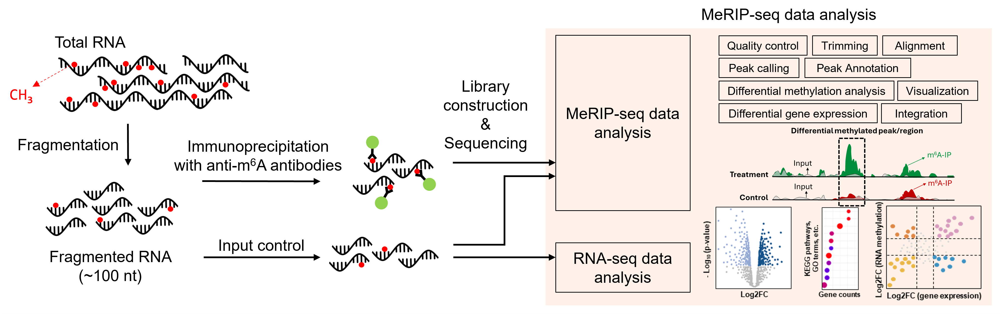

# Explore RNA methylation using MeRIP-seq
---------------------------------

## **Contents**

+ [Overview](#Overview)
+ [Background](#Background)
+ [Before Starting](#Before-Starting)
+ [Getting Started](#Getting-Started)
+ [Software Requirements](#Software-Requirements)
+ [Architecture Design](#Architecture-design)
+ [Data](#Data)
+ [Funding](#Funding)
+ [License for Data](#License-for-Data)

## **Overview**
The MeRIP-seq data analysis tutorial is structured into four submodules, designed to comprehensively guide users through the complete workflow for RNA methylation analysis. These include:
- **Preprocessing and Quality Control**: This submodule covers data retrieval, quality control, and alignment steps to prepare raw sequencing data for downstream analysis. Data is downloaded from sources like NCBI SRA, stored in an AWS S3 bucket, and processed using Python in Jupyter notebooks on SageMaker.
- **Peak Calling and Differential Analysis**: This step focuses on identifying m6A-enriched regions (peaks) using peak-calling tools and performing differential methylation analysis across conditions using R-based workflows.
- **Downstream Analysis and Visualization**: Users explore RNA methylation patterns, perform functional enrichment analyses (e.g., GO and KEGG), and integrate methylation and gene expression data to uncover biologically meaningful insights. Visualization tools such as volcano plots and meta-gene plots are also emphasized for effective data interpretation.
- **Workflow Automation with Nextflow**: To simplify the analysis process, a Nextflow-based automated pipeline is introduced. This pipeline integrates all analysis steps, enabling seamless execution on AWS, with outputs stored directly in S3 buckets for easy access and reproducibility.

Additionally, an **introductory module** (Submodule-0) provides foundational knowledge about RNA methylation, including its biological significance and technical aspects of MeRIP-seq. The tutorial leverages AWS SageMaker for scalability and efficiency, employing both Python and R kernels, making it accessible and adaptable for bioinformatics researchers.

## **Background**
The epitranscriptome encompasses all biochemical modifications of RNA in a cell, representing a rapidly evolving area of study within molecular biology. 

**RNA methylation** is a form of epitranscriptome modification that occurs on RNA molecules. The most common and well-studied type of RNA methylation is N6-methyladenosine (m6A), where a methyl group (-CH3) is added to the nitrogen at position 6 of adenosine bases in RNA. RNA methylation plays critical roles in various biological processes, such as: mRNA stability, translation regulation, RNA splicing and RNA localization. This modification is dynamically regulated by writers (methyltransferases that add m6A), erasers (demethylases that remove m6A), and readers (proteins that recognize and bind to m6A to mediate its functions). 

**MeRIP-seq** (Methylated RNA Immunoprecipitation Sequencing) is a high-throughput technique used to map RNA methylation, particularly N6-methyladenosine (m6A), across the transcriptome. This method combines immunoprecipitation, using an m6A-specific antibody, with RNA sequencing to identify RNA fragments that are enriched for m6A modifications. The process begins by pulling down m6A-marked RNA fragments from total RNA using the antibody, followed by sequencing both the immunoprecipitated (IP) and input RNA libraries. By comparing these datasets, researchers can pinpoint the locations of m6A modifications, referred to as m6A peaks, along RNA transcripts. MeRIP-seq provides a powerful tool for studying the role of m6A in regulating RNA stability, translation, splicing, and other post-transcriptional processes, offering new insights into gene expression regulation in development, disease, and response to environmental changes.

This **MeRIP-seq data analysis** module includes methods for investigating RNA methylation patterns, focusing on N6-methyladenosine (m6A). The process starts with preprocessing raw sequencing data by aligning it to a reference genome, followed by peak calling to identify regions enriched with m6A modifications. Differential methylation analysis is then performed to compare m6A levels across experimental conditions, such as normal versus tumor, uncovering biologically significant changes. To contextualize these findings, downstream analyses such as functional enrichment are employed to map differentially methylated regions to biological processes, pathways, or gene sets, providing insights into their roles in cellular functions. Integration with gene expression data further illuminates the interplay between methylation and transcriptional regulation, revealing genes that are concurrently differentially methylated and expressed. Throughout the analysis, visualization techniques, including volcano plots, meta-gene plots, and coverage maps, are used to enhance interpretability, enabling researchers to connect m6A modifications to broader regulatory networks and their implications in development, disease, and environmental responses.

## **Before Starting**
These tutorials were designed to be used on Amazon Web Services (AWS), with the aim of requiring nothing but the files within this GitHub repository. However, you do need to set up your Amazon account to access the SageMaker notebooks to use the notebooks. The steps you need before getting started:
    - Set up a AWS account
    - Enable APIs (SageMaker, EC2, S3, HealthOmics)

More detailed instructions can refer to NIH Cloud Lab README for more instructions.

## **Getting Started**
This repository contains several notebook files that serve as bioinformatics MeRIPseq data analysis workflow tutorials. These instructions will guide you through setting up an AWS SageMaker Notebook instance, downloading the tutorial files, and running them.

**1. Setting Up an AWS SageMaker Notebook Instance**
- Log in to AWS Management Console:
    - Navigate to the AWS SageMaker Console (Find **Amazon SageMaker AI** in the Services, or search it in the search bar)
- Create a SageMaker Notebook Instance:
    - Click **Notebooks**" in the left navigation pane (under Applications and IDEs, in Amazon SageMaker AI).
    - Click "**Create notebook instance**" at the top of the Notebook instances.
    - Fill out the following details:
        - Notebook instance name: Provide a unique name (e.g., notebook-yourname-date).
        - Instance type: Choose **ml.t3.xlarge** (or a larger instance type if your dataset is large, [more examples](https://docs.aws.amazon.com/sagemaker/latest/dg/notebooks-available-instance-types.html)).
        - Click "**Addtional configurations**"
            - Lifecycle Configuration (Optional): Add a script to install any additional dependencies automatically.
            - **Volumne size in GB**: change it to **50**
        - IAM Role: If you don’t have an existing role, create a new one with S3 full access and AmazonSageMakerFullAccess permissions.
- Start the Notebook Instance:
    - Click "**Create notebook instance**" and wait for the status to change to "InService".

**2. Cloning the Tutorials Repository**
- Open the Notebook Instance:
    - Once the instance is active, click "Open JupyterLab" to access the notebook.
- Clone the Repository:
    - Open a terminal from the Jupyter interface.
    - Run the following command:
        - <code>**git clone https://github.com/yqin-UH/NIGMS-Sandbox2-MeRIP.git**</code>
    - This will create a folder containing all tutorial files.
    
**3. Running the Tutorials**
- Locate Tutorial Files:
    - Navigate to the folder (just cloned) from the Jupyter interface.
- Open a Tutorial Notebook:
    - Double-click the <code>**.ipynb**</code> files (the tutorials) to open them in the Jupyter Notebook environment.
- Execute Notebook Cells and run the tutorials:
    - Run each section, or "cell," sequentially by clicking the Run button (▶) in the toolbar.
    - A running cell is indicated by an asterisk ([*]). Once it completes, the asterisk will change to a number indicating the order of execution.
    - [More instructions](https://www.dataquest.io/blog/jupyter-notebook-tutorial/) on how to use jupyter notebooks

## **Software Requirements**
In this module, you will need access to a Jupyter notebook in AWS SageMaker environment. The environment settings are listed here:

(need to be updated)
Environment : Python 3 (with Intel® MKL)
Environment version :M97
IPython :7.33.0
ipykernel :6.16.0
jupyter_client :7.3.5
jupyter_core :4.11.1
jupyter_server :1.19.1
jupyterlab :3.4.7
nbclient :0.6.8
nbconvert :7.0.0
nbformat :5.6.1
notebook :6.4.12
traitlets :5.4.0

For **submodule 1**, you can install all necessary requirements using the instructions in submodule 1, and the detailed software versions used in this tutorial (Dec, 2024) are listed here:
- Python 3.10.15
- conda 24.7.1 (pre-installed)
- mamba 1.5.9 
- bedtools 2.31.1
- FastQC 0.12.1
- MultiQC 1.25.2
- Trim Galore! 0.6.10
- STAR 2.7.11b
- Samtools 1.21
- deepTools 3.55
- ucsc-bigWigMerge 469
- MACS2 2.2.9.1
- MEME 5.5.7

For **submodule 2 and 3**, the R kernels are used and the detailed package versions used in this tutorial (Dec, 2024) are listed here:
- R 4.4.1 (2024-06-14)
- Bioconductor version            3.20 (BiocManager 1.30.25)
- devtools                       2.4.5
- Rsamtools                     2.22.0
- GenomicFeatures               1.58.0
- DESeq2                        1.46.0
- qvalue                        2.38.0
- txdbmaker                      1.2.1
- BSgenome.Hsapiens.UCSC.hg38    1.4.5
- Guitar                        2.22.0
- GenomicRanges                 1.58.0
- ChIPpeakAnno                  3.40.0
- VennDiagram                    1.7.3
- rtracklayer                   1.66.0
- ggplot2                        3.5.1
- Rcpp                        1.0.13-1
- RcppArmadillo               14.2.2-1
- BH                          1.84.0-0
- doParallel                    1.0.17
- foreach                        1.5.2
- gplots                         3.2.0
- RColorBrewer                   1.1-3
- MeRIPtools                     0.2.1
- RADAR                          0.2.4
- exomePeak2                    1.16.2
- EnhancedVolcano  1.24.0
- clusterProfiler  4.14.4
- org.Hs.eg.db     3.20.0

## **Architecture Design**

## **Data**
The dataset used in this tutorial is derived from **GSE119168**, which was originally published as part of the study using the **RADAR** pipeline for MeRIP-seq. The RADAR pipeline is a computational framework designed to identify m6A-modified regions in RNA, specifically focusing on high-throughput MeRIP-seq data analysis, and we will use it for downstream analysis in the next tutorial. The dataset includes six omental tumor tissues and seven normal fallopian tube tissues, and both input and m6A immunoprecipation libraries were sequenced by the NextSeq 500 platform at PE37 mode (pair-end, 37bp). 

For this tutorial, a subset of the original data has been selected, focusing specifically on chromosome 11 (chr11:1-1,000,000). This region was chosen to include the **HRAS** gene, which is a key gene implicated in cancer progression and is regulated by m6A methylation. The HRAS gene is highlighted in another study ([Pan, Yongbo, et al.  PNAS (2023)](https://www.pnas.org/doi/abs/10.1073/pnas.2302291120)), which demonstrates how m6A modifications on HRAS RNA influence tumor progression, making it a biologically relevant region for studying m6A methylation.

The dataset provides a small, manageable region of the genome for tutorial purposes, enabling users to quickly process the data and explore m6A peak calling and motif discovery in the context of a known cancer-associated gene. 

This example dataset is stored at an AWS S3 bucket: s3://ovarian-cancer-example-fastqs

## **Funding**

## **License for Data**

